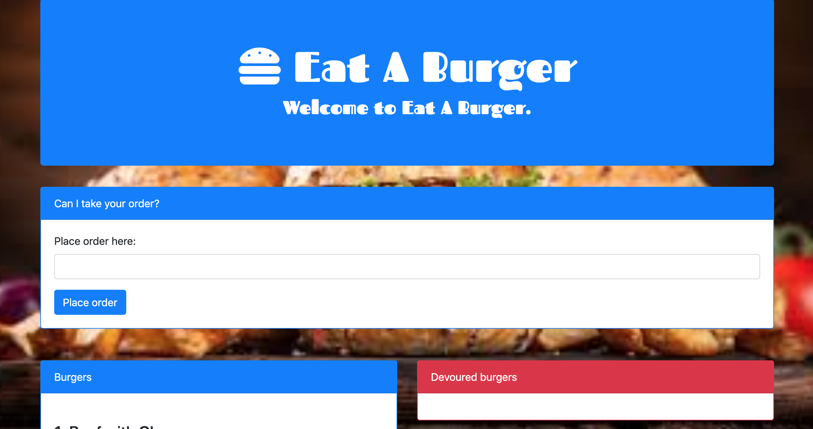

# Eat A Burger
Full Stack app following the MVC design pattern

## Purpose:
This app is to demostrate a Full Stack application that the MVC design pattern.
This app also utilizes handlebars.

## Product Features

## How it works:
Place your order by choosing a burger type you would like and click the Place Order Button.  Your order will be added to the database and displayed in the Burgers area.  Click the Eat Me button to Devour the burger and it will update in the database and display in the Devoured section along with the option to "Throw Away" the burger, deleting it from the database.

## Functionality to add:
Use Sequalize instead of the ORM

## Contributors:
I, Brad Hoffman, am the sole contributor to this app.
